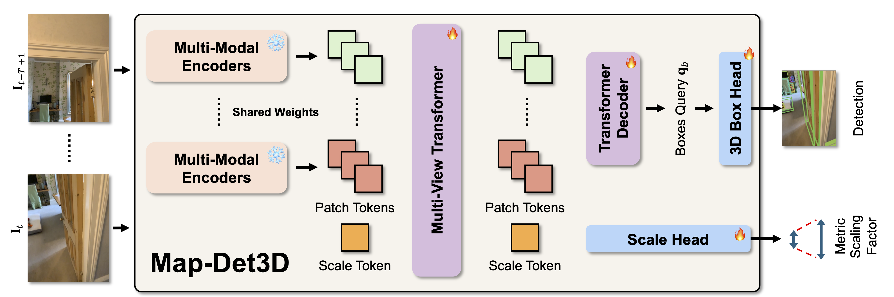

<div align="center">

# Map-Det3D: Metric Feed-Forward 3D Reconstruction Prior for Multi-view 3D Object Detection from Streaming Inputs

<a href="#"></a>
<a href='https://royyang0714.github.io/Map-Det3D'></a>
<a href='https://huggingface.co/RoyYang0714/Map-Det3D'></a>

</div>

<div>
  
</div>

<div>
  <p></p>
</div>

> [**Map-Det3D: Metric Feed-Forward 3D Reconstruction Prior for Multi-view 3D Object Detection from Streaming Inputs**](https://royyang0714.github.io/Map-Det3D) \
> Yung-Hsu Yang, Luigi Piccinelli, Samuel Rota Bulò, Sunghwan Hong, Denis Rozumny, Johannes Schönberger, Zuria Bauer, Hermann Blum, Peter Kontschieder, Marc Pollefeys \
> ECCV 2026

## News and ToDo
- [ ] 04.08.2026: Release code and models.

## Citation

If you find our work useful in your research please consider citing our publications:
```bibtex
```
